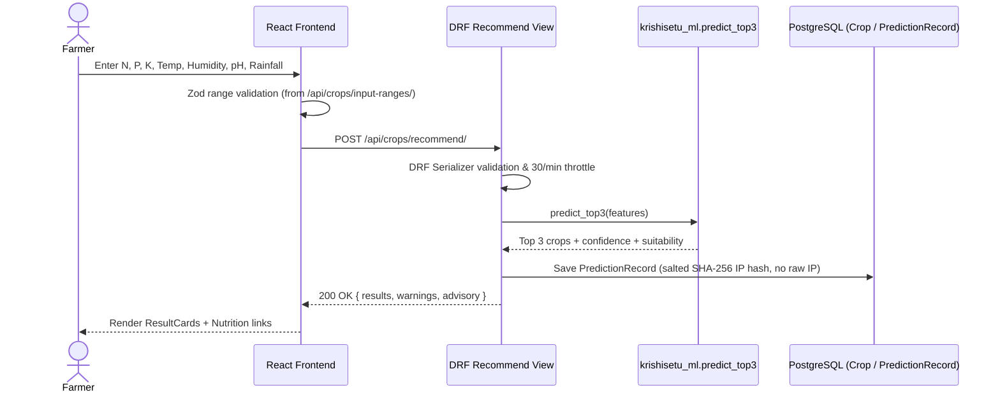
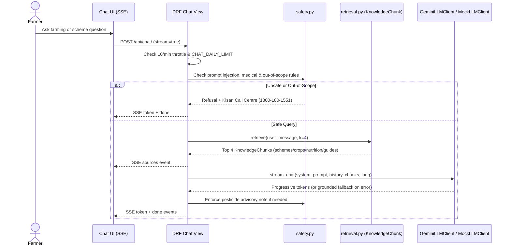

# Request Data Flows

## 1. Crop Recommendation Flow (`POST /api/crops/recommend/`)

```mermaid
sequenceDiagram
    actor Farmer
    participant UI as React Frontend
    participant API as DRF Recommend View
    participant ML as krishisetu_ml.predict_top3
    participant DB as PostgreSQL (Crop / PredictionRecord)

    Farmer->>UI: Enter N, P, K, Temp, Humidity, pH, Rainfall
    UI->>UI: Zod range validation (from /api/crops/input-ranges/)
    UI->>API: POST /api/crops/recommend/
    API->>API: DRF Serializer validation & 30/min throttle
    API->>ML: predict_top3(features)
    ML-->>API: Top 3 crops + confidence + suitability
    API->>DB: Save PredictionRecord (salted SHA-256 IP hash, no raw IP)
    API-->>UI: 200 OK { results, warnings, advisory }
    UI-->>Farmer: Render ResultCards + Nutrition links
```

## 2. Krishi Mitra Chat Flow (`POST /api/chat/`)

```mermaid
sequenceDiagram
    actor Farmer
    participant UI as Chat UI (SSE)
    participant API as DRF Chat View
    participant Safety as safety.py
    participant RAG as retrieval.py (KnowledgeChunk)
    participant LLM as GeminiLLMClient / MockLLMClient

    Farmer->>UI: Ask farming or scheme question
    UI->>API: POST /api/chat/ (stream=true)
    API->>API: Check 10/min throttle & CHAT_DAILY_LIMIT
    API->>Safety: Check prompt injection, medical & out-of-scope rules
    alt Unsafe or Out-of-Scope
        Safety-->>API: Refusal + Kisan Call Centre (1800-180-1551)
        API-->>UI: SSE token + done
    else Safe Query
        API->>RAG: retrieve(user_message, k=4)
        RAG-->>API: Top 4 KnowledgeChunks (schemes/crops/nutrition/guides)
        API-->>UI: SSE sources event
        API->>LLM: stream_chat(system_prompt, history, chunks, lang)
        LLM-->>API: Progressive tokens (or grounded fallback on error)
        API->>Safety: Enforce pesticide advisory note if needed
        API-->>UI: SSE token + done events
    end
```
