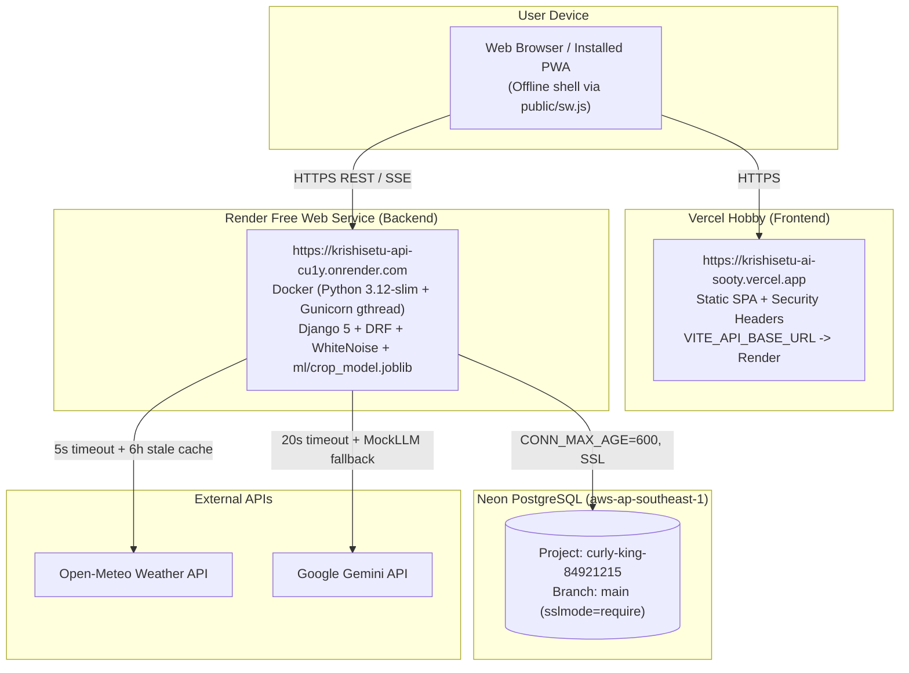

# Production Deployment Architecture

```mermaid
flowchart TB
    subgraph Client["User Device"]
        Browser["Web Browser / Installed PWA\n(Offline shell via public/sw.js)"]
    end

    subgraph Vercel["Vercel Hobby (Frontend)"]
        V["https://krishisetu-ai-sooty.vercel.app\nStatic SPA + Security Headers\nVITE_API_BASE_URL -> Render"]
    end

    subgraph Render["Render Free Web Service (Backend)"]
        R["https://krishisetu-api-cu1y.onrender.com\nDocker (Python 3.12-slim + Gunicorn gthread)\nDjango 5 + DRF + WhiteNoise + ml/crop_model.joblib"]
    end

    subgraph Neon["Neon PostgreSQL (aws-ap-southeast-1)"]
        N[("Project: curly-king-84921215\nBranch: main (sslmode=require)")]
    end

    subgraph External["External APIs"]
        OM["Open-Meteo Weather API"]
        GM["Google Gemini API"]
    end

    Browser -->|HTTPS| V
    Browser -->|HTTPS REST / SSE| R
    R -->|CONN_MAX_AGE=600, SSL| N
    R -->|5s timeout + 6h stale cache| OM
    R -->|20s timeout + MockLLM fallback| GM
```
