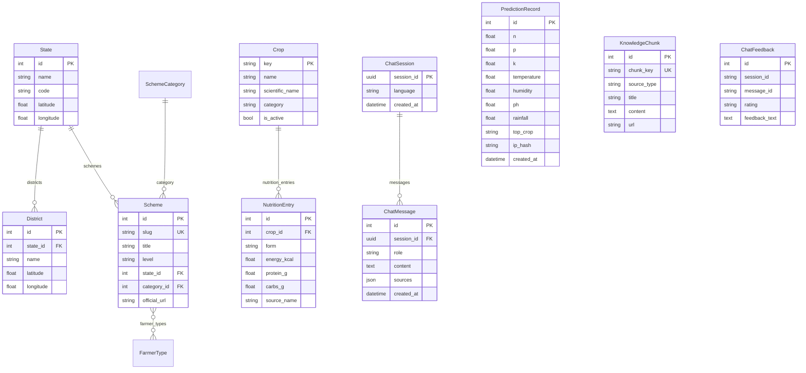

# Entity-Relationship Diagram

Verified against Django models in `backend/apps/*/models.py`.

```mermaid
erDiagram
    State ||--o{ District : "districts"
    State ||--o{ Scheme : "schemes"
    SchemeCategory ||--o{ Scheme : "category"
    Scheme }o--o{ FarmerType : "farmer_types"
    Crop ||--o{ NutritionEntry : "nutrition_entries"
    ChatSession ||--o{ ChatMessage : "messages"

    Crop {
        string key PK
        string name
        string scientific_name
        string category
        bool is_active
    }

    PredictionRecord {
        int id PK
        float n
        float p
        float k
        float temperature
        float humidity
        float ph
        float rainfall
        string top_crop
        string ip_hash
        datetime created_at
    }

    NutritionEntry {
        int id PK
        int crop_id FK
        string form
        float energy_kcal
        float protein_g
        float carbs_g
        string source_name
    }

    State {
        int id PK
        string name
        string code
        float latitude
        float longitude
    }

    District {
        int id PK
        int state_id FK
        string name
        float latitude
        float longitude
    }

    Scheme {
        int id PK
        string slug UK
        string title
        string level
        int state_id FK
        int category_id FK
        string official_url
    }

    KnowledgeChunk {
        int id PK
        string chunk_key UK
        string source_type
        string title
        text content
        string url
    }

    ChatSession {
        uuid session_id PK
        string language
        datetime created_at
    }

    ChatMessage {
        int id PK
        uuid session_id FK
        string role
        text content
        json sources
        datetime created_at
    }

    ChatFeedback {
        int id PK
        string session_id
        string message_id
        string rating
        text feedback_text
    }
```
