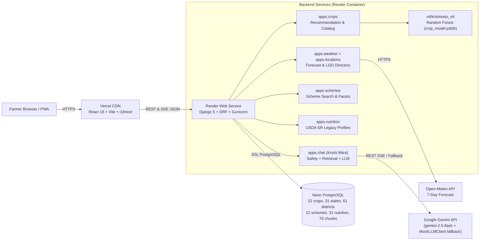

# System Architecture

```mermaid
flowchart LR
    User["Farmer Browser / PWA"] -->|HTTPS| Vercel["Vercel CDN\nReact 18 + Vite + i18next"]
    Vercel -->|REST & SSE JSON| Render["Render Web Service\nDjango 5 + DRF + Gunicorn"]

    subgraph Backend["Backend Services (Render Container)"]
        Render --> CropsApp["apps.crops\nRecommendation & Catalog"]
        Render --> WeatherApp["apps.weather + apps.locations\nForecast & LGD Directory"]
        Render --> SchemesApp["apps.schemes\nScheme Search & Facets"]
        Render --> NutritionApp["apps.nutrition\nUSDA SR Legacy Profiles"]
        Render --> ChatApp["apps.chat (Krishi Mitra)\nSafety + Retrieval + LLM"]
        CropsApp --> ML["ml/krishisetu_ml\nRandom Forest (crop_model.joblib)"]
    end

    Render -->|SSL PostgreSQL| Neon[("Neon PostgreSQL\n22 crops, 31 states, 61 districts\n12 schemes, 31 nutrition, 70 chunks")]
    WeatherApp -->|HTTPS| OpenMeteo["Open-Meteo API\n7-Day Forecast"]
    ChatApp -->|REST SSE / Fallback| Gemini["Google Gemini API\n(gemini-2.5-flash + MockLLMClient fallback)"]
```
